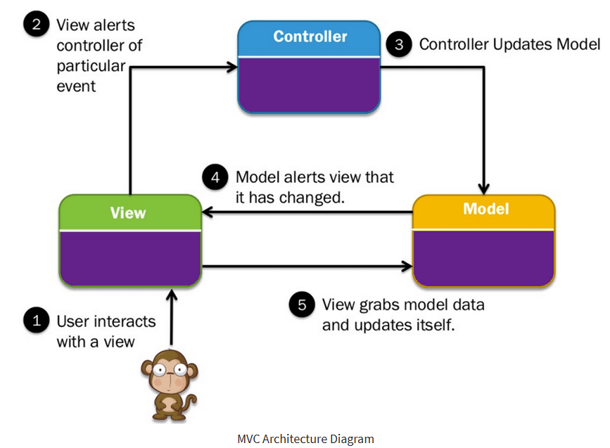
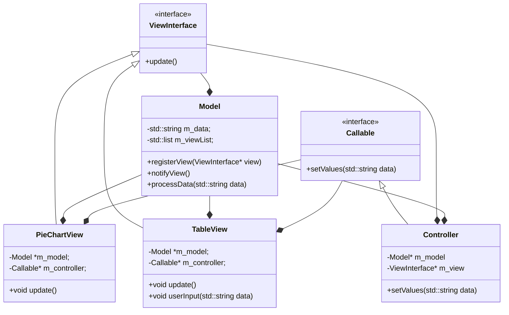
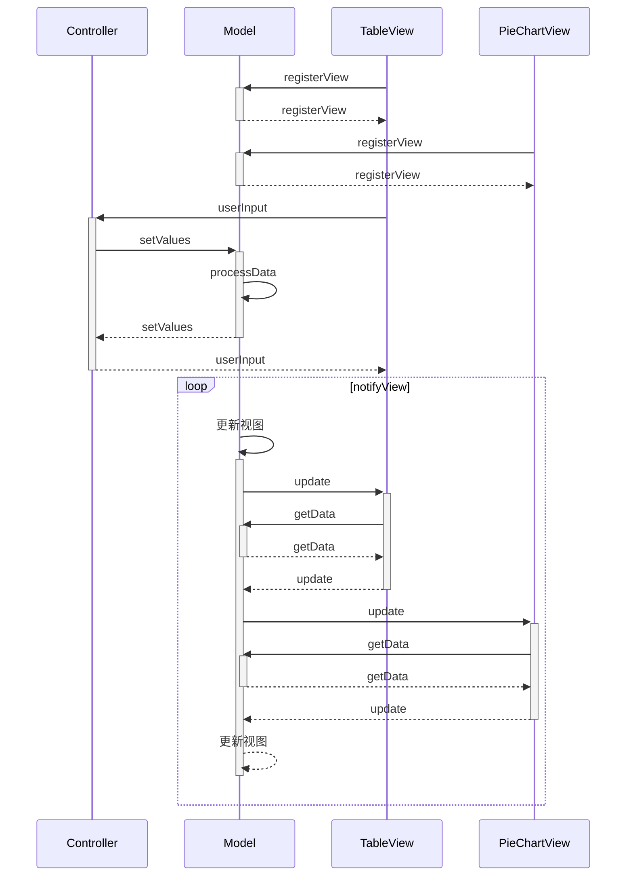

# MVC
A implementation of the MVC pattern 

### MVC架构模式确定了数据和数据加工在模型中、数据的显示在视图、对用户输入的解释在控制器。视图和控制器共同组成了用户接口。
>三个组件的任务如下：
+ **模型**包括核心功能，它封装了系统的数据和对数据的加工。
+ **视图**把数据展示给用户，它含有模型要展示的数据。
+ **控制器**负责接收用户的输入，并负责对输入的内容做解释。

